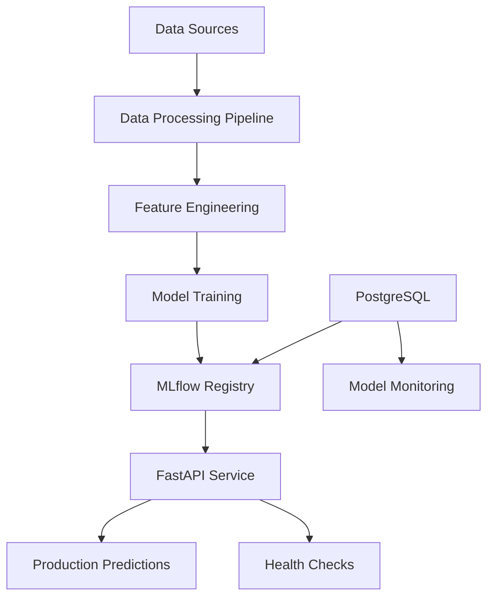

# Technical Documentation

## Architecture Overview

### System Components



### Data Flow

1. **Raw Data Ingestion**: ARFF files are processed and combined
2. **Feature Engineering**: Financial ratios and derived features are computed
3. **Model Training**: Multiple ML algorithms are trained and evaluated
4. **Model Registry**: Best models are stored in MLflow
5. **API Serving**: Models are served via FastAPI endpoints
6. **Monitoring**: Performance and data drift are tracked

## Model Architecture

### Individual Models

#### XGBoost Classifier
- **Algorithm**: Gradient Boosting Decision Trees
- **Key Parameters**:
  - `max_depth`: 6
  - `learning_rate`: 0.1
  - `n_estimators`: 200
  - `objective`: 'binary:logistic'
- **Performance**: AUC ~0.974
- **Use Case**: Primary model for production

#### LightGBM Classifier
- **Algorithm**: Light Gradient Boosting Machine
- **Key Parameters**:
  - `num_leaves`: 50
  - `learning_rate`: 0.05
  - `n_estimators`: 300
  - `objective`: 'binary'
- **Performance**: AUC ~0.971
- **Use Case**: Fast inference alternative

#### Random Forest Classifier
- **Algorithm**: Ensemble of Decision Trees
- **Key Parameters**:
  - `n_estimators`: 200
  - `max_depth`: 15
  - `class_weight`: 'balanced'
- **Performance**: AUC ~0.965
- **Use Case**: Interpretable baseline model

### Ensemble Methods

#### Voting Classifier
- **Strategy**: Weighted soft voting
- **Weights**: XGBoost (40%), LightGBM (40%), Random Forest (20%)
- **Performance**: AUC ~0.966

#### Stacking
- **Meta-learner**: Logistic Regression
- **Cross-validation**: 5-fold stratified
- **Base models**: All individual models

## Feature Engineering

### Raw Features
- **attr1-attr64**: Original financial ratios from dataset
- **years_before_bankruptcy**: Temporal indicator (1-5 years)

### Derived Features
- **liquidity_score**: Composite liquidity measure
- **profitability_score**: Profit margin indicators
- **leverage_risk**: Debt-to-equity derived metrics
- **altman_z_score**: Bankruptcy prediction score approximation

### Feature Processing
1. **Infinite Value Handling**: Replace ±∞ with ±1e10
2. **Missing Value Imputation**: Median imputation for numerical features
3. **Outlier Treatment**: Winsorization at 1st and 99th percentiles
4. **Standardization**: Optional scaling for linear models

## API Documentation

### Endpoints

#### `POST /predict`
Predict bankruptcy for single company.

**Request Body:**
```json
{
  "attr1": 0.56,
  "attr2": 0.12,
  ...
  "attr64": 0.45,
  "years_before_bankruptcy": 2,
  "company_id": "optional"
}
```

**Response:**
```json
{
  "prediction": 0,
  "probability": 0.15,
  "risk_level": "low",
  "model_version": "BankruptcyXgboost_v2",
  "timestamp": "2024-01-15T10:30:00Z",
  "features_used": 65
}
```

#### `POST /predict/batch`
Batch prediction for multiple companies.

**Request Body:**
```json
{
  "samples": [
    {...},  // Array of prediction requests
    {...}
  ]
}
```

#### `GET /models`
List available models from MLflow registry.

#### `GET /health`
Service health check.

### Error Handling

- **400 Bad Request**: Invalid input data
- **422 Validation Error**: Pydantic validation failed
- **500 Internal Server Error**: Model or system error

## Database Schema

### Models Table Structure

#### `companies`
```sql
CREATE TABLE companies (
    id SERIAL PRIMARY KEY,
    name VARCHAR(255) NOT NULL,
    registration_id VARCHAR(100) UNIQUE,
    industry VARCHAR(100),
    created_at TIMESTAMP DEFAULT CURRENT_TIMESTAMP,
    updated_at TIMESTAMP DEFAULT CURRENT_TIMESTAMP
);
```

#### `predictions`
```sql
CREATE TABLE predictions (
    id SERIAL PRIMARY KEY,
    company_id INTEGER REFERENCES companies(id),
    model_version VARCHAR(100) NOT NULL,
    prediction INTEGER NOT NULL CHECK (prediction IN (0, 1)),
    probability FLOAT NOT NULL CHECK (probability >= 0 AND probability <= 1),
    risk_level VARCHAR(20) CHECK (risk_level IN ('low', 'medium', 'high')),
    features JSONB NOT NULL,
    created_at TIMESTAMP DEFAULT CURRENT_TIMESTAMP,
    model_name VARCHAR(100),
    years_before_bankruptcy INTEGER
);
```

#### `model_monitoring`
```sql
CREATE TABLE model_monitoring (
    id SERIAL PRIMARY KEY,
    model_name VARCHAR(100) NOT NULL,
    model_version VARCHAR(100) NOT NULL,
    metric_name VARCHAR(100) NOT NULL,
    metric_value FLOAT NOT NULL,
    evaluation_date DATE NOT NULL,
    created_at TIMESTAMP DEFAULT CURRENT_TIMESTAMP
);
```

## Deployment

### Docker Compose Services

#### PostgreSQL
- **Image**: postgres:13
- **Purpose**: Database backend for MLflow and application data
- **Volumes**: Persistent storage for data
- **Health checks**: Built-in readiness probes

#### MLflow Server
- **Build**: Custom Dockerfile
- **Purpose**: Experiment tracking and model registry
- **Dependencies**: PostgreSQL
- **Ports**: 5000

#### FastAPI Application
- **Build**: Custom Dockerfile
- **Purpose**: Model serving API
- **Dependencies**: PostgreSQL, MLflow
- **Ports**: 8000
- **Health checks**: HTTP endpoint monitoring

### Environment Configuration

Required environment variables:
- `POSTGRES_USER`, `POSTGRES_PASSWORD`, `POSTGRES_DB`
- `MLFLOW_TRACKING_URI`, `MLFLOW_BACKEND_STORE_URI`
- `API_SECRET_KEY`, `LOG_LEVEL`

### Security Considerations

1. **Environment Variables**: All sensitive data in environment variables
2. **Docker Security**: Non-root user in containers
3. **Network Security**: Internal Docker networking
4. **Data Validation**: Input validation with Pydantic
5. **Health Checks**: Service monitoring and restart policies

## Monitoring and Observability

### Model Performance Tracking
- **Metrics**: AUC, Precision, Recall, F1-Score
- **Frequency**: Per model evaluation
- **Storage**: MLflow metrics tracking

### System Health
- **API Health**: `/health` endpoint
- **Database Health**: Connection monitoring
- **MLflow Health**: Registry accessibility

### Data Quality Monitoring
- **Feature Drift**: Statistical drift detection
- **Input Validation**: Schema validation
- **Outlier Detection**: Statistical anomaly detection

## Testing Strategy

### Unit Tests
- **Models**: Individual classifier testing
- **API**: Endpoint validation
- **Features**: Feature engineering validation
- **Coverage Target**: >80%

### Integration Tests
- **Database**: Data persistence
- **MLflow**: Model loading/saving
- **API Flow**: End-to-end request processing

### Performance Tests
- **Load Testing**: API throughput
- **Model Inference**: Latency benchmarks
- **Memory Usage**: Resource consumption

## Development Workflow

### Local Development
1. Clone repository
2. Setup virtual environment
3. Install dependencies: `pip install -e .`
4. Run tests: `pytest`
5. Start services: `docker-compose up`

### Code Quality
- **Formatting**: Black, isort
- **Linting**: flake8
- **Type Checking**: mypy (optional)
- **Pre-commit Hooks**: Automated checks

### Model Development
1. Data exploration in notebooks
2. Feature engineering experimentation
3. Model training with MLflow tracking
4. Model evaluation and selection
5. Model deployment to registry

## Performance Optimization

### Model Optimization
- **Hyperparameter Tuning**: Optuna integration
- **Early Stopping**: Training optimization
- **Feature Selection**: Importance-based selection
- **Model Compression**: Quantization for deployment

### API Optimization
- **Caching**: Model caching in memory
- **Batch Processing**: Efficient batch predictions
- **Async Processing**: Asynchronous request handling
- **Connection Pooling**: Database optimization

### Infrastructure Optimization
- **Resource Limits**: Container resource constraints
- **Scaling**: Horizontal scaling with Docker Compose
- **Load Balancing**: Multiple API instances
- **Monitoring**: Resource usage tracking

## Troubleshooting

### Common Issues

#### Model Loading Errors
- Check MLflow connection
- Verify model registry names
- Check environment variables

#### Database Connection Issues
- Verify PostgreSQL service status
- Check connection strings
- Review Docker networking

#### API Performance Issues
- Monitor resource usage
- Check model caching
- Review batch sizes

#### Feature Engineering Errors
- Validate input data format
- Check for infinite/NaN values
- Review feature transformation logic